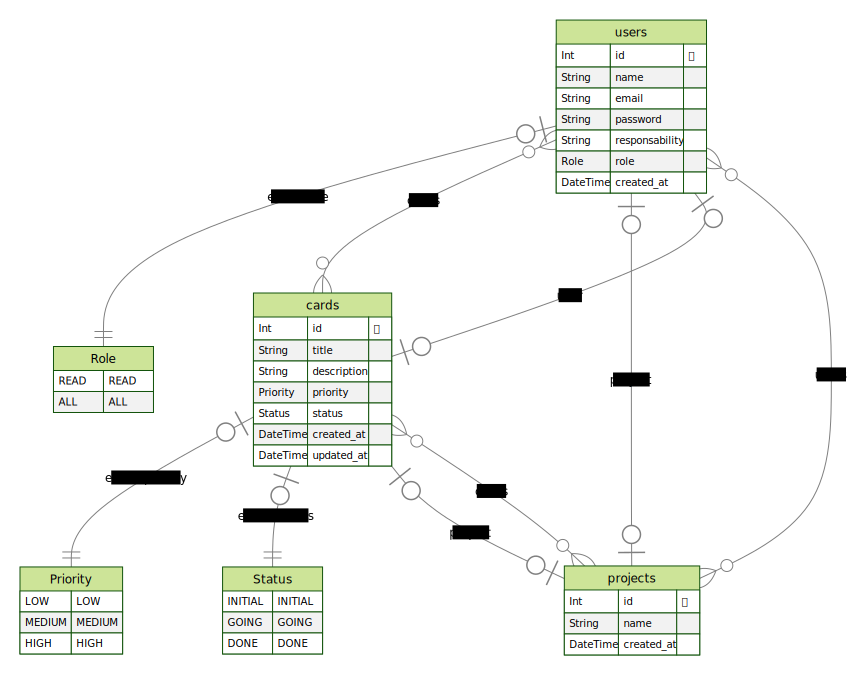

# Project Manager W3 - PM3
## Sistema para auxílio educacional ou profissional ⚓

O aplicativo possibilitará ao usuário, gerir seus projetos com uma metodologia ágil (Framework Scrum), facilitando aos stakeholders ter uma visão geral dos processos envolvidos!

## Diagrama ERD

